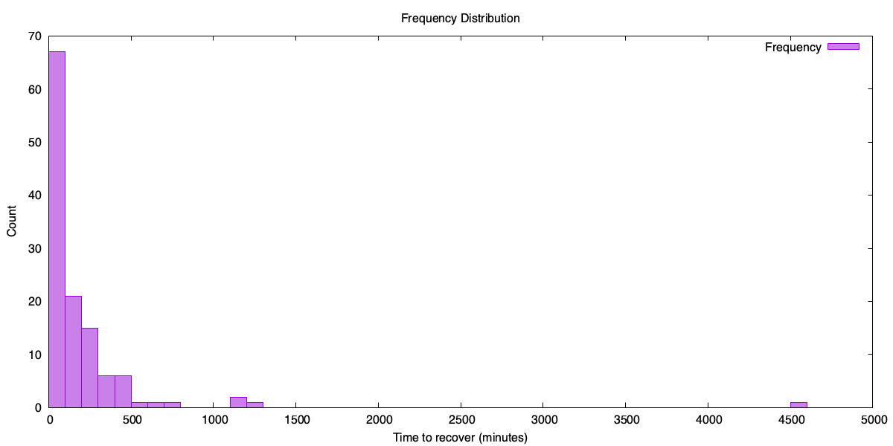

# GitHub Availability Report Analysis

This repository includes the result of analyzing GitHub Availability Report. This program aims to collect realistic failure scenario for my study.

The original data source is GitHub Tech Blog as below.

https://github.blog/tag/github-availability-report/

## Results



## Prerequisite

```
$ python --version
Python 3.12.2

$ gnuplot --version
gnuplot 6.0 patchlevel 2
```

## Usage

Crawler

```
python -m venv env
. env/bin/activate
pip install BeautifulSoup4 requests
python crawl.py
```

Summarizer

```
bash summary.sh
python summary2.py
python summary3.py

# create graph
make
```
